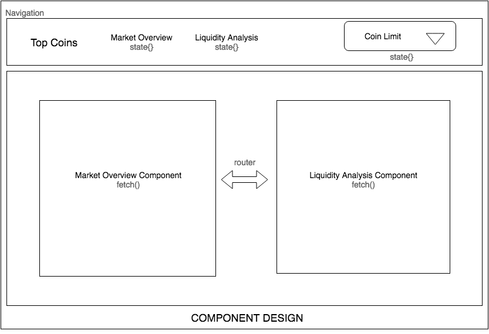

 ## Install, Test & Run

```
$ yarn install
$ yarn start
$ yarn test
```

## Problem Statement

The task is to develop a webapp which provides market capitalization and liquidity analysis of top crypto coins.

### Functional Requirements

- The app should consist of a navigation bar with the following two pages:

    - ```/``` - Market Overview
    - ```/liquidity``` - Liquidity Analysis

- Select menu inside the navigation bar to change the number of coins. It should have a global scope affecting data on both the pages mentioned above.

- Market Overview page should render a table to show real-time data, sorted by rank.

- Liquidity Analysis page should render a scatter plot chart to show real-time market capitalization, volume and absolute price change (24h). 

- The chart should also consist of an interactive tooltip with the above mentioned information along with the coin names.

### Technical Requirements

- Create a frontend that communicates with the ticker API and fetches real-time data.

- The frontend should be intuitive to use.

- Accompany the code with test suite.

## Component Design

 

- __App Component__: Controls navigation and is responsible for passing real-time data to nav-items.

The App Component uses two main components:

- __MarketOverview Component__: Renders a table with data received from the ticker API.
- __LiquidityAnalysis Component__: Renders an interactive Scatter Chart to show the market cap, volume and price change of each coin. 

Components for customization and code simplicity:

- __MarketOverviewRow Component__: Passes real-time data as props to the table.
- __CustomTooltip Component__: To customize tooltips for the Scatter Plot Chart. 

## Technical Choices

- __Libraries__

    - __Frontend Framework__: As mentioned in the requirements, I have used React to build this app. Since this app requires limited functionalities and fewer inter-component interactions, React(a view library) seems to be a good choice over AngularJS(which is a full framework). React provides an easier way to think and design UI.

    - __UI Framework__: React-bootstrap has been used to make the app responsive. Since it is based on twitter bootstrap, it is always possible to step into plain html to design a custom element.

    - __Charts__: Recharts.js has been used since it provides a scatter plot chart with all x, y, and z dimensions..

    - __Testing__: Enzyme, react-test-renderer, jest and chai have been used for testing. Enzyme is a great package by airbnb which makes writing declarative tests for React quite easy. 


## Roadmap

- A better visual design.
- Evaluate Redux for state management.
- Refractor App.js.
- Use asynchoronous task to update ticker data every _n_ seconds.
- Add more UI interaction tests.
